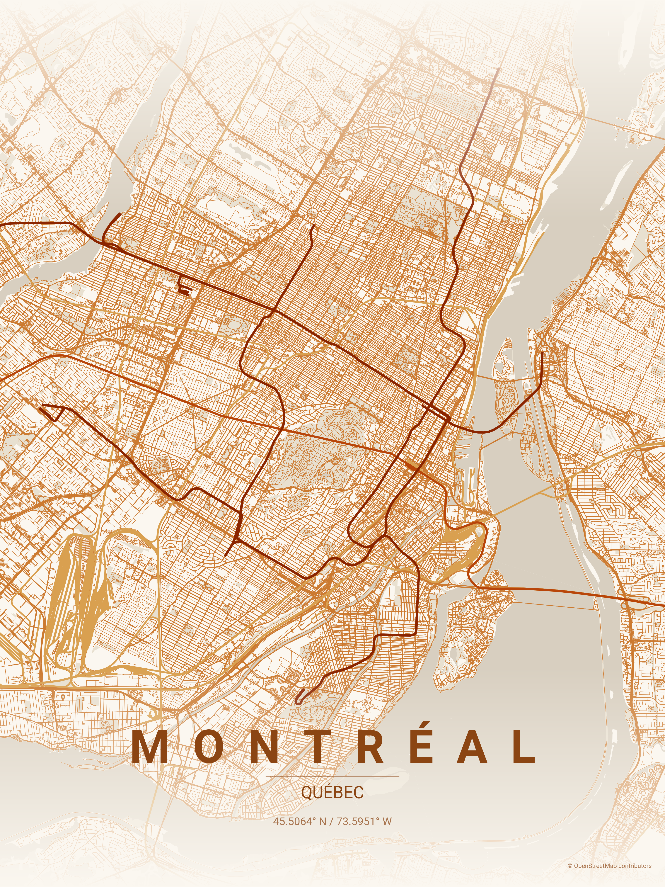
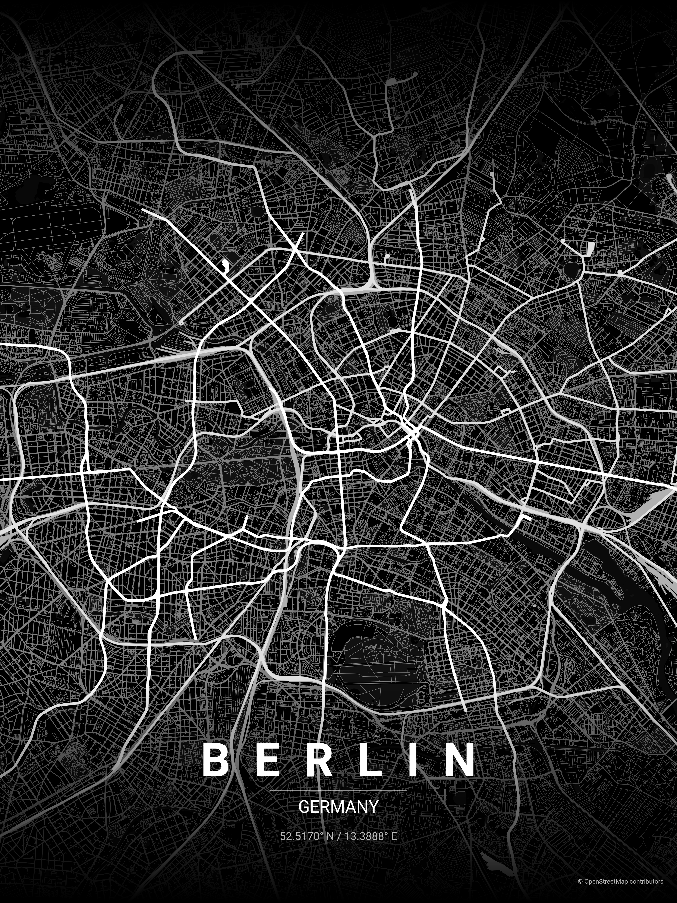
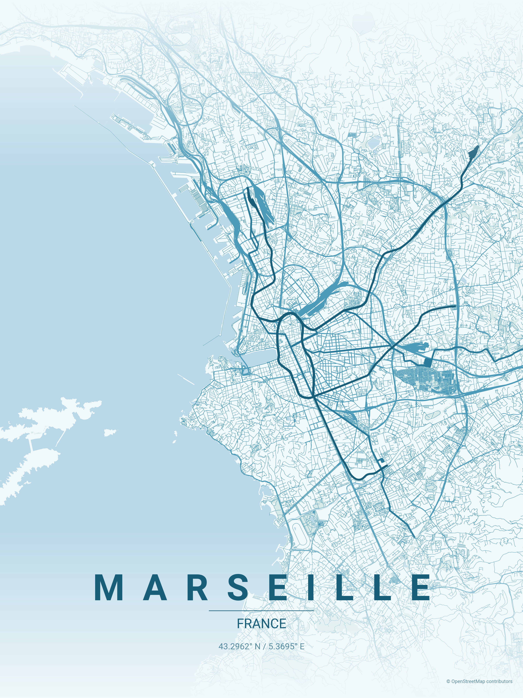
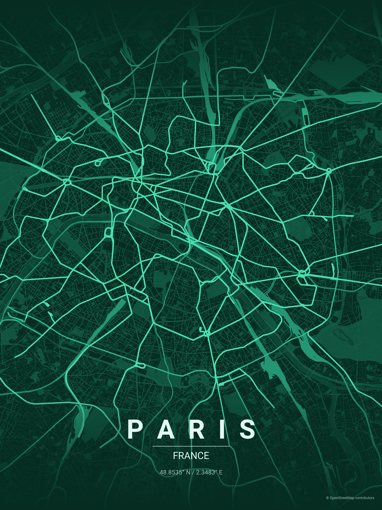
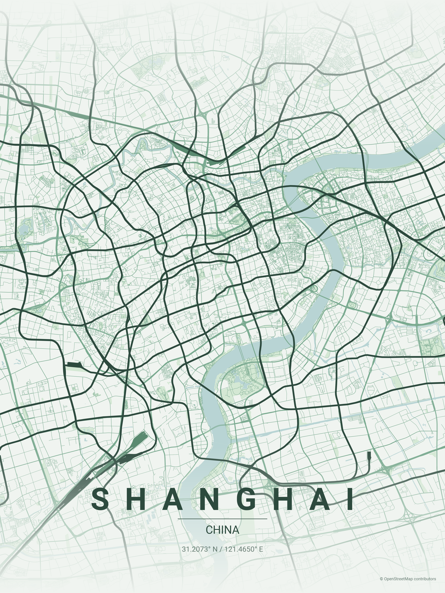
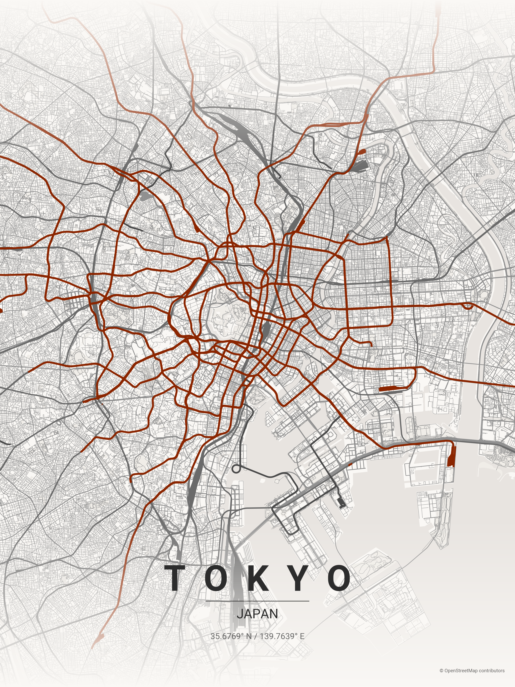

# City Map Poster Generator

***Fork of [originalankur/maptoposter](https://github.com/originalankur/maptoposter)***

Generate beautiful map posters with an emphasis on public transportation
for any city in the world.



## Installation

```bash
python -m venv .venv
source venv/bin/activate
pip install .
```

## Usage

```bash
python -m maptoposter -l <location> -t <title> -s <subtitle> -r <radius> -T <theme>
python -m maptoposter --list-themes
```

## Examples

```bash
python -m maptoposter -l "52.5170120, 13.3888222" -t Berlin -s Germany -r 10000 -T noir
```



```bash
python -m maptoposter -l "43.2961743, 5.3699525" -t Marseille -s France -r 8000 -T ocean
```



```bash
python -m maptoposter -l "45.50677, -73.59524" -t Montréal -s Québec -r 12000 -T autumn
```


```bash
python -m maptoposter -l "48.8534951, 2.3483915" -t Paris -s France -r 8000 -T emerald
```



```bash
python -m maptoposter -l "31.2074091, 121.4649932" -t Shanghai -s China -r 10000 -T forest
```



```bash
python -m maptoposter -t Tokyo -s Japan -r 12000 -T japanese_ink 
```



### Distance Guide

| Distance | Best for |
| -------- | -------- |
| 4000-6000m | Small/dense cities (Venice, Amsterdam center) |
| 8000-12000m | Medium cities, focused downtown (Paris, Barcelona) |
| 15000-20000m | Large metros, full city view (Tokyo, Mumbai) |

